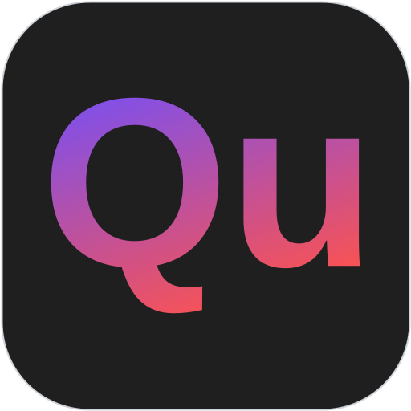

<h1 align="left">Quviu          
</h1>


Quviu (**Qu**ick **vi**deo **u**tilities) is an easy-to-use GUI for FFmpeg that allows you to quickly re-encode and trim video files.

<p align="center">
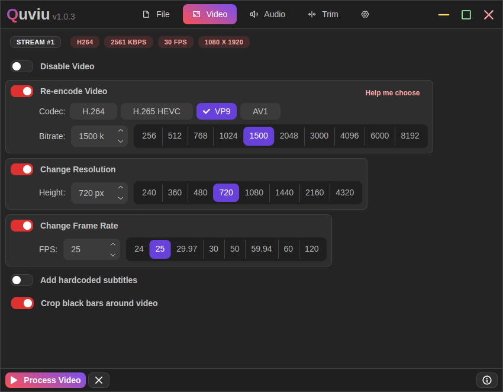
</p>

> [!WARNING]
> **Work in Progress 🚧:** This program is in its early stages of development and code is a mess. Expect bugs and missing features. Also the macOS build has not been tested because I don't own a Mac. Use at your own risk

## Features

- Simple and fast UI – just a few clicks to select all the necessary options
- Re-encode audio and video to selected codecs with specific bitrates
- Change video resolution
- Adjust framerate
- Trim video clips
- Remove audio or video tracks
- Add hardcoded subtitles
- Automatically crop black bars from around the video
- Merge multiple audio streams into one
- Light/Dark mode with multiple accent color choices
- Available for Windows, Linux and macOS

## Requirements

This application requires **ffmpeg** to be installed and accessible from your system PATH. If ffmpeg is not available globally, you can manually specify custom paths to the ffmpeg (and ffprobe, if needed) binaries in the app settings.

## Installation

Just download and install the latest package for your system from the [Releases](https://github.com/patryk-ku/quviu/releases) page. Portable, no-installation versions are also available.

## Screenshots

<p align="center">
	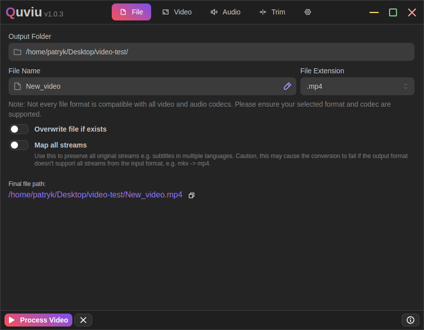
    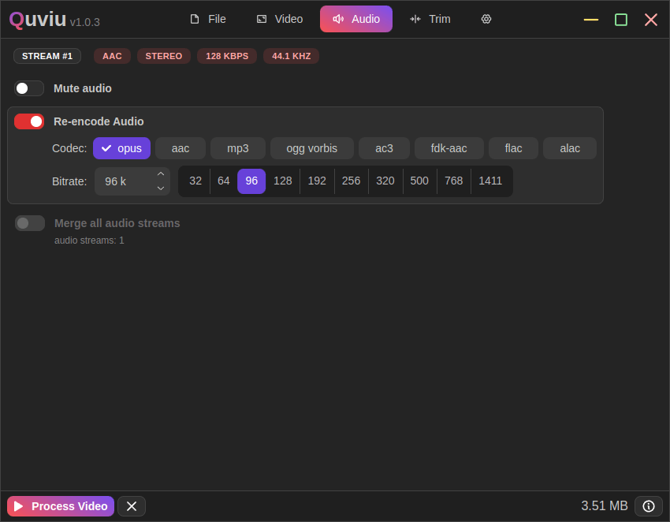
    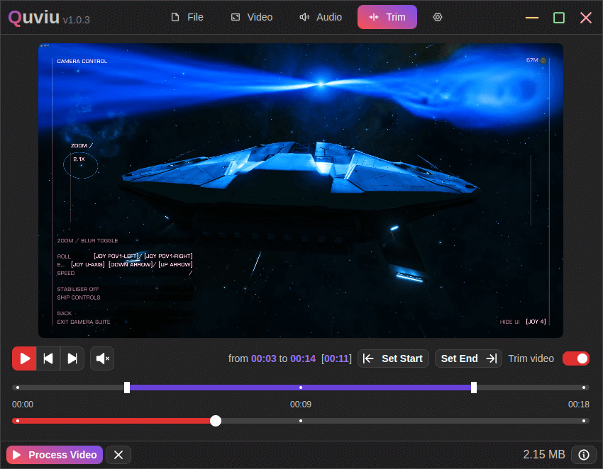
    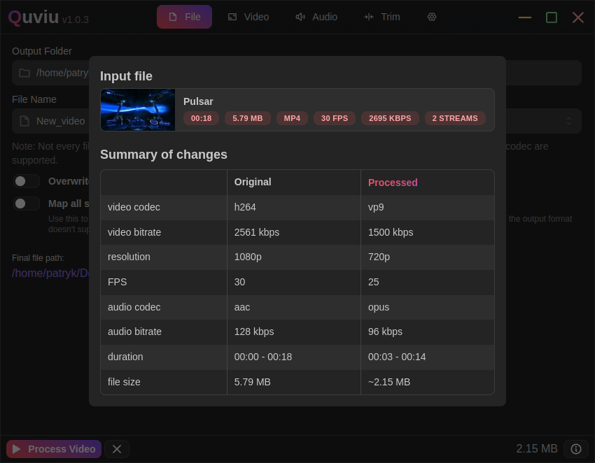
    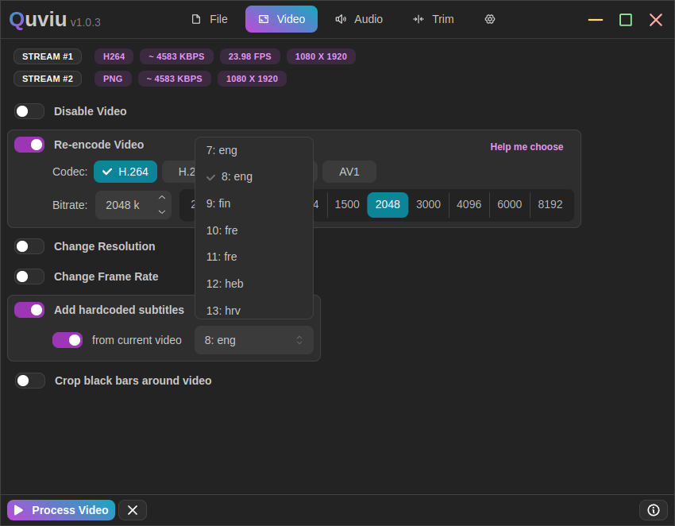
    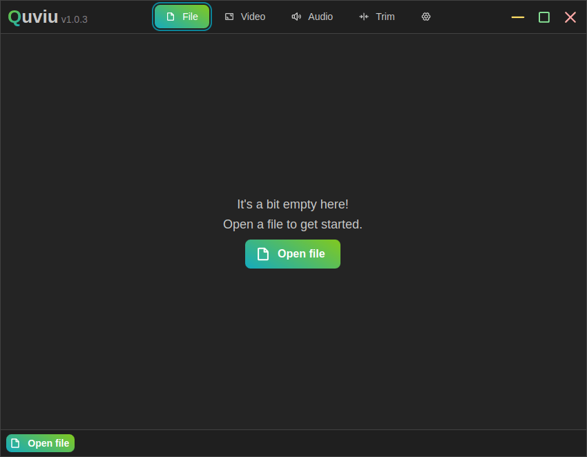
    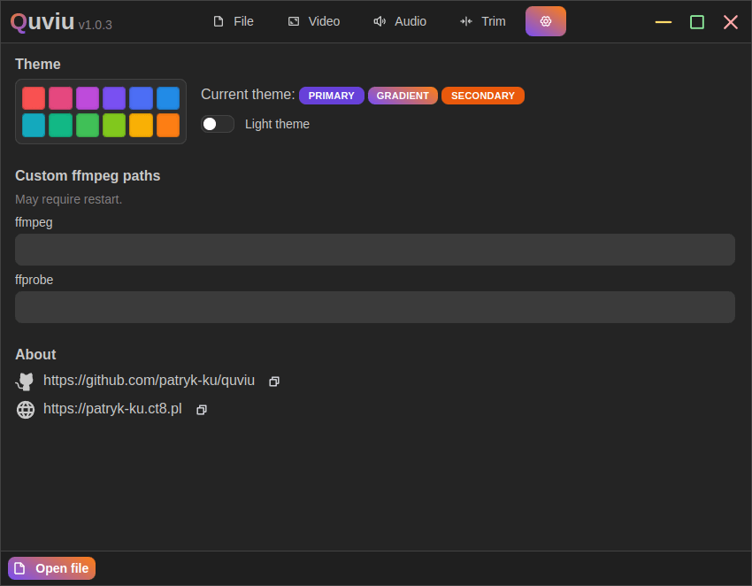
    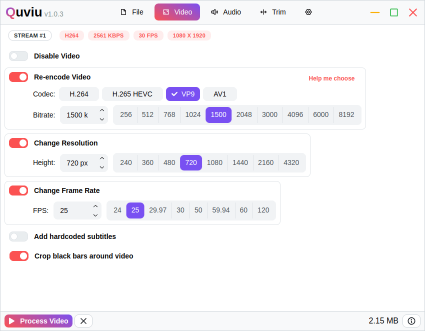
    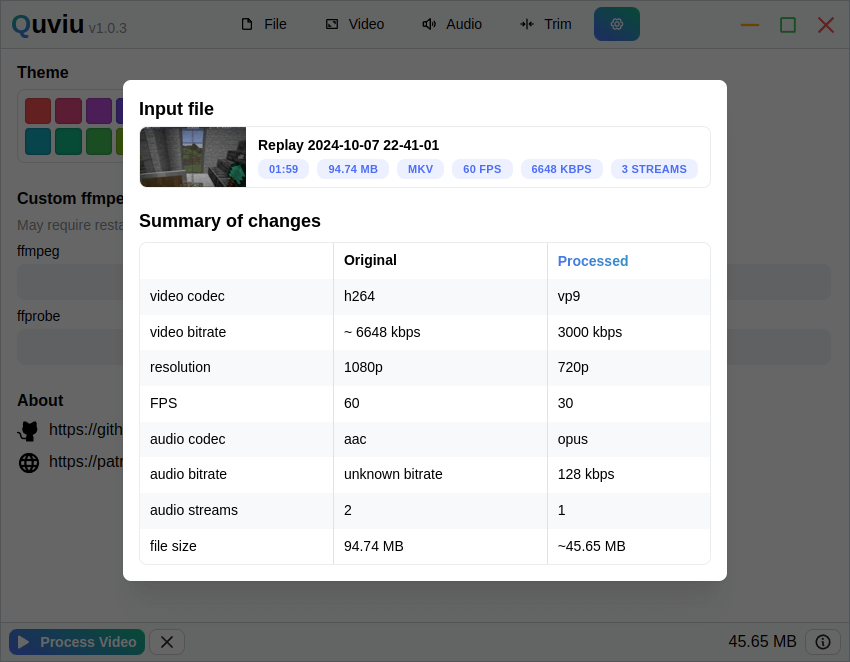
</p>

## Why I Built This

Originally, whenever I needed to quickly convert or compress a file to send it to someone, I used ffmpeg in the terminal. At first, I created a text file with a list of commands to copy and just swapped out the file paths. Eventually, I turned it into a Bash script. However, as I kept adding more options, it became cumbersome, so I decided to quickly build a simple GUI in Electron. In the end, I refined it a bit and released it on GitHub in case it might be useful to someone else.

Why didn’t I use an existing program? I know there are many tools like this out there: HandBrake for example, but they’re often large and complex. I needed something simple, fast, and easy to use.
Why Electron and JavaScript? Because I’m most comfortable with JS, and I always wanted to learn how to build desktop apps with Electron. I know it’s overkill for such a simple tool, but I don’t mind because it works for me.

## Build from source

### Install

```sh
git clone "https://github.com/patryk-ku/quviu"
cd quviu
pnpm install
```

### Launch dev session

```sh
pnpm dev
```

### Build

```sh
# For windows
pnpm build:win

# For macOS
pnpm build:mac

# For Linux
pnpm build:linux
```
